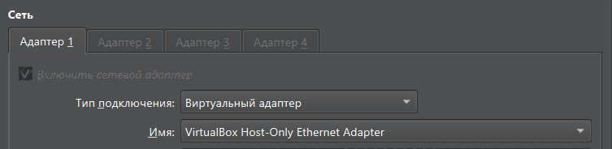
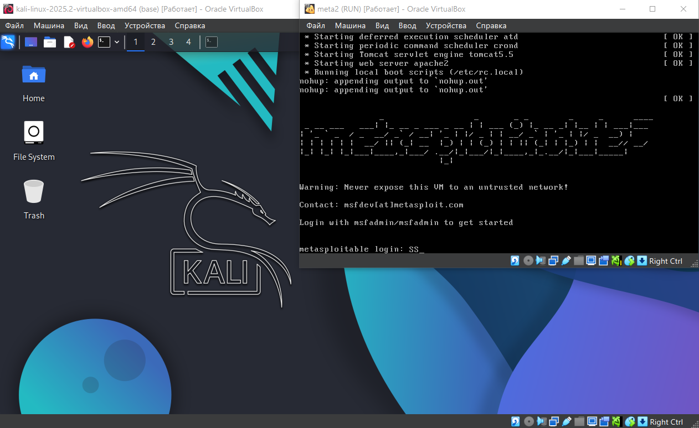
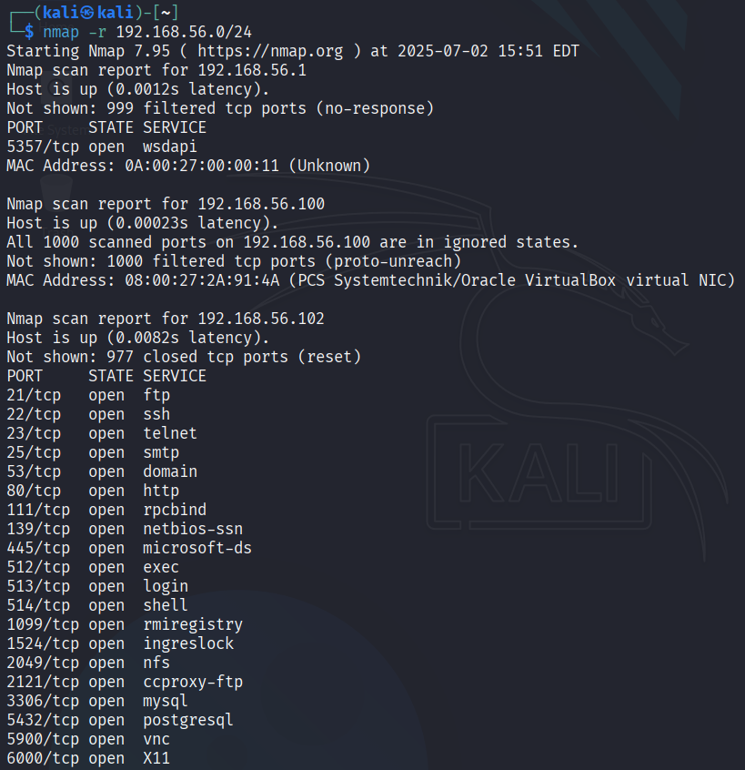
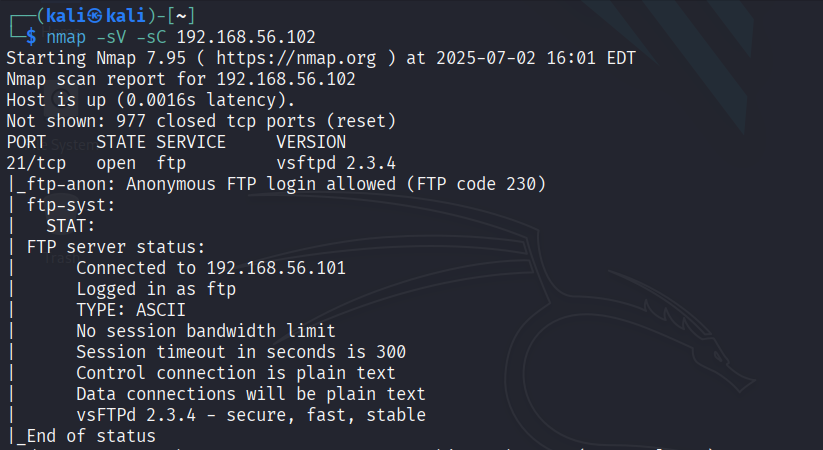
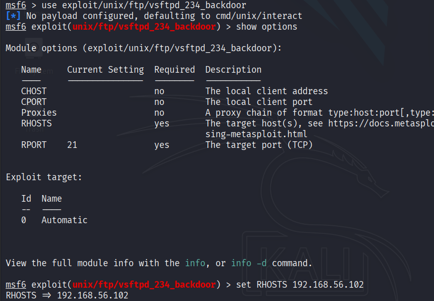
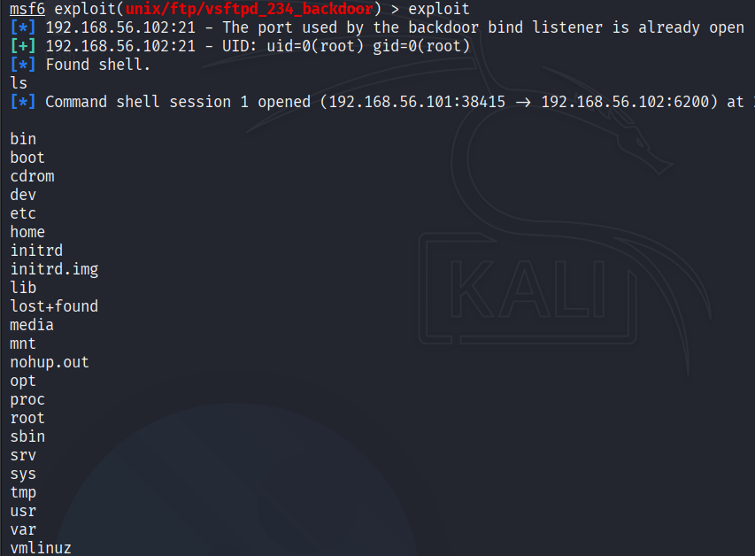

# MITRE ATT&CK

MITRE ATT&CK (Adversarial Tactics, Techniques, and Common Knowledge) — это база знаний, которая описывает различные тактики, техники и методы, используемые киберпреступниками при атаках на информационные системы.

## Тактики, техники и подтехники

Тактика отвечает на вопрос «почему?» выполняется техника или подтехника ATT&CK. Это тактическая цель злоумышленника, причина совершения действия. 

Техника отвечает на вопрос «как?» злоумышленник достигает тактической цели, выполняя определенное действие.

Подтехника — это более конкретное, низкоуровневое описание действия злоумышленника. Например, атакующий может модифицировать системный сервис ОС Windows чтобы закрепиться в системе.

Список тактик:
- [Разведка (Reconnaissance)](https://attack.mitre.org/tactics/TA0043/) 
    > Цель: собрать информацию, которую можно использовать для планирования будущих действий. 

- [Подготовка ресурсов (Resource Development)](https://attack.mitre.org/tactics/TA0042/)
    > Цель: создать ресурсы, которые можно использовать для поддержки дальнейших действий.

- [Первоначальный доступ (Initial Access)](https://attack.mitre.org/tactics/TA0001/)
    > Цель: попасть в пределы целевой сети.

- [Выполнение (Execution)](https://attack.mitre.org/tactics/TA0002/)
    > Цель: запустить вредоносный код.

- [Закрепление (Persistence)](https://attack.mitre.org/tactics/TA0003/) 
    > Цель: сохранить доступ после перезапуска, изменения учетных данных и других событий системы.

- [Повышение привилегий (Privilege Escalation)](https://attack.mitre.org/tactics/TA0004/)
    > Цель: получить в системе права более высокого уровня.

- [Предотвращение обнаружения (Defense Evasion)](https://attack.mitre.org/tactics/TA0005/)
    > Цель: избежать обнаружения.

- [Получение учётных данных (Credential Access)](https://attack.mitre.org/tactics/TA0006/)
    > Цель: украсть имена учетных записей и пароли.

- [Обнаружение (Discovery)](https://attack.mitre.org/tactics/TA0007/) 
    > Цель: получить знания о системе и внутренней сети.

- [Перемещение внутри периметра (Lateral Movement)](https://attack.mitre.org/tactics/TA0008/)
    > Цель: вход и получение управления удаленными системами в сети.

- [Сбор данных (Collection)](https://attack.mitre.org/tactics/TA0009/)
    > Цель: собрать данные, представляющие интерес.

- [Организация управления (Command and Control)](https://attack.mitre.org/tactics/TA0011/)
    > Цель: взаимодействовать с компрометированными системами для их контроля.

- [Эксфильтрация данных (Exfiltration)](https://attack.mitre.org/tactics/TA0010/)
    > Цель: украсть данные.

- [Деструктивное воздействие (Impact)](https://attack.mitre.org/tactics/TA0040/)
    > Цель: манипулировать целевыми системами и данными или уничтожить их.

# Практика

Рассмотрим применение матрицы ATT&CK на практике.

## Подготовка среды

Смоделируем инцидент с помощью Metasploit и виртуальной машины [Metasploitable](https://www.vulnhub.com/entry/metasploitable-2,29/). Metasploit - это платформа для разработки и тестирования эксплойтов, а также для проведения тестирования на проникновение (пентеста). 

Настроим виртуальные машины так, чтобы они были в одной сети, для этого подключим их к одному виртуальному адаптеру:

Запустим виртуальные машины. 

## Reconnaissance

Просканируем сеть с помощью nmap:

Видим FTP-сервер по адресу `192.168.56.102:21` (и ещё много чего).

## Discovery

Исследуем FTP-сервер:

На машине стоит vsftpd версии 2.3.4. Известно, что данная версия имеет backdoor.

## Initial Access

Запустим `msfconsole`. Используем `vsftpd_234_backdoor`. С помощью команды `show options` узнаем требуемые параметры. Установим remote host командой `set RHOSTS 192.168.56.102`.

Запускаем эксплойт и получаем доступ к машине.

## Краткое описание инцидента

Злоумышленник обнаружил в сети сервер с открытым портом 21 (FTP). Используя сканер, атакующий определил, что на сервере запущен vsftpd версии 2.3.4, содержащий бэкдор. Был применен эксплойт, позволивший получить удаленную командную оболочку с правами root. В результате злоумышленник получил полный контроль над системой.

## Описание инцидента с помощью MITRE ATT&CK

- **Reconnaissance/Active Scanning/Scanning IP Blocks (T1595.001)**:  
  Обнаружение сервера с открытым портом 21 (FTP).
- **Discovery/Network Service Discovery (T1046)**:  
  Определение версии vsftpd 2.3.4, содержащей backdoor.
- **Initial Access/Exploit Public-Facing Application (T1190)**:  
  Эксплуатация уязвимости FTP-сервера.
- **Privilege Escalation/Exploitation for Privilege Escalation (T1068)**:  
  Автоматическое получение прав root после успешной эксплуатации.

## Sources

- [metasploitable](https://www.vulnhub.com/entry/metasploitable-2,29/)
- [MITRE ATT&CK официальная версия](https://attack.mitre.org/)
- [MITRE ATT&CK от PT](https://mitre.ptsecurity.com/ru-RU)
- [habr перевод FAQ](https://habr.com/ru/articles/658293/)
- [habr успешная атака по кусочкам](https://habr.com/ru/articles/886972/)