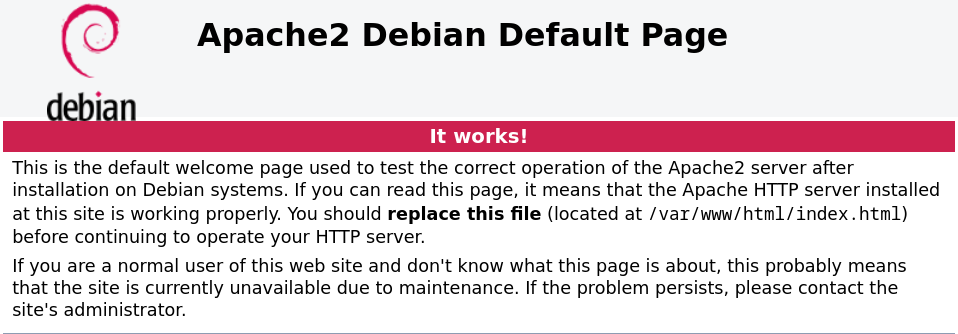

# nginx

nginx — это свободный высокопроизводительный HTTP-сервер с открытым исходным кодом, а также обратный прокси и почтовый прокси-сервер. nginx получил широкое распространение благодаря своей стабильности, богатой функциональности, простой настройке и низкому потреблению ресурсов. 

## Установка на Debian

`# apt install nginx`

Проверим работоспособность сервера.

`# systemctl status nginx.service`

Если обратиться по адресу `http://127.0.0.1`, получим следующее сообщение:

> Welcome to nginx!<br>
If you see this page, the nginx web server is successfully installed and working. Further configuration is required.<br>
For online documentation and support please refer to nginx.org.
Commercial support is available at nginx.com.<br>
Thank you for using nginx.

## Конфигурация

Для примера создадим файл [example.html](html/example.html) и настроим сервер, чтобы он возвращал его в ответ на запросы по адресу `localhost:9080`.

```
http {                     # создаём контекст html
  server {                 # создаём контекст сервер
    listen localhost:9080; # слушаем localhost:9080
    location / {           # если префикс запроса - '/',
      root /data/www;      # то отображаем запрос на каталог /data/www
    }
  }
}
```

После перезагрузки конфигурации с помощью команды `nginx -s reload`, запрос `http://localhost:9080/example.html` должен вернуть файл `/data/www/example.html`.


# Apache

Apache — это свободное программное обеспечение с открытым исходным кодом, которое используется для создания веб-серверов. 

## Установка на Debian

`# apt install apache2`

После установки запустим сервер командой:

`# apachectl start`

Теперь можно обратиться по адресу `http://127.0.0.1` и убедиться в работоспособности сервера.



## Конфигурация

Конфигурация apache производится через конфигурационный файл. В моём случае это `/etc/apache2/apache2.conf`. Добавим в него директиву `Include my-vhost.conf` и создадим соответствующий файл:

```
Listen 9080                  # Слушаем порт 9080
<VirtualHost 127.0.0.1:9080> # Добавляем хост с адресом "127.0.0.1:9080"
  ServerName localhost       # Даем хосту имя
  DocumentRoot /data/www     # Указываем каталог для отображения запросов
  <Directory "/data/www">    # Настраиваем доступ к каталогу
    Options -Indexes         # Запрещаем листинг
    Require all granted      # Разрешаем доступ всем
  </Directory>

  # Настраиваем логирование
  ErrorLog ${APACHE_LOG_DIR}/error-9080.log 
  LogLevel info
</VirtualHost>
```

Чтобы изменения применились перезапустим сервер: 

`# apachectl reload`

Запрос `http://localhost:9080/example.html` должен вернуть файл `/data/www/example.html`.

## Sources 

### nginx

- [Arch wiki](https://wiki.archlinux.org/title/Nginx_(%D0%A0%D1%83%D1%81%D1%81%D0%BA%D0%B8%D0%B9))
- [nginx doc](http://nginx.org/)

### Apache

- [Apache doc](https://httpd.apache.org/docs/current/getting-started.html)
