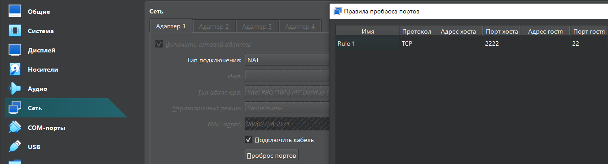
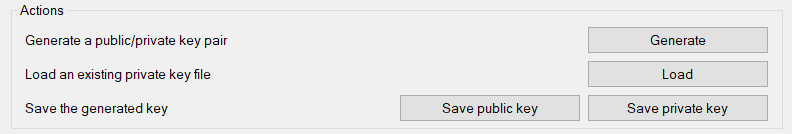
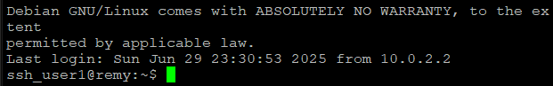
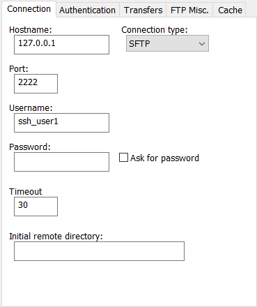
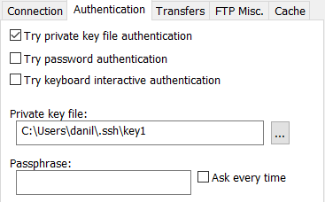

# SSH

## Introduction

SSH (Secure Shell) — сетевой протокол прикладного уровня, позволяющий производить удалённое управление операционной системой и туннелирование TCP-соединений.

Для изучения SSH-протокола выполним следующие таски:

- Создать отдельного пользователя.
- Установка SSH-сервера.
- Настроить запрет подключения root.
- Настроить запрет аутентификации по паролю.
- Подключиться по SSH через putty.
- Подключиться со своего Windows, своим пользователем через notepad++. Плагин: NppFTP. Протокол sftp.

## Установим SSH-сервер

Установим SSH-сервер на виртуальную машину Debian.

`# apt install openssh-server`

Проверим статус демона ssh.

`# systemctl status ssh`

Должны получить `Active: active (running)`.

## Добавим нового пользователя

`# useradd -m ssh_user1`

Установим пароль:

`# passwd ssh_user1`

Установим оболочку по-умолчанию:

`# usermod -s /bin/bash ssh_user1`

Далее будем работать от имени ssh_user1.

## Генерация ключей

Перед отключением аутентификации по паролю, настроим аутентификацию по ключу.

Ключи можно генерировать с использованием разных криптографических алгоритмов, воспользуемся [Ed25519: сгенерированные по нему ключи — самые безопасные](https://yandex.cloud/ru/docs/glossary/ssh-keygen?utm_referrer=https%3A%2F%2Fwww.google.com%2F#authentication). 

Выполним команду для генерации ключей:

`$ ssh-keygen -t ed25519 -f ~/.ssh/key1`

Получим открытый и закрытый ключ `ls .ssh -la`:

```
-rw------- 1 ssh_user1 ssh_user1  411 Jun 29 21:55 key1
-rw------- 1 ssh_user1 ssh_user1   96 Jun 29 21:55 key1.pub
```

## Настроим SSH-сервер

Добавим в файл `~/.ssh/authorized_keys` наш публичный ключ. Настроим права доступа:
```
$ chown -R $USER:$USER ~/.ssh
$ chmod 700 ~/.ssh
$ chmod 644 ~/.ssh/*
$ chmod 600 ~/.ssh/key* ~/.ssh/authorized_keys
```

Настройка сервера производится через файл `/etc/ssh/sshd_config`. Добавим следующие строчки:

```
# Предоставить доступ ssh_user1
AllowUsers ssh_user1

# Запрет подключения root
PermitRootLogin no

# Отключение аутентификации по паролю
PasswordAuthentication no
PermitEmptyPasswords no

# Включение аутентификации по ключу
PubkeyAuthentication yes
AuthorizedKeysFile .ssh/authorized_keys
```

Перезапустим сервер:

`# systemctl restart sshd`

Попробуем подключиться к нашему серверу:

`$ ssh ssh_user1@127.0.0.1 -i ~/.ssh/key1`

В случае успеха должны увидеть приветственное сообщение.

Чтобы каждый раз не указывать путь до ключа и имя пользователя, можно создать `~/.ssh/config`:

```
Host 127.0.0.1
    User ssh_user1
    IdentityFile ~/.ssh/key1
    IdentitiesOnly yes
```

## Проброс портов VirtualBox

Далее будем посылать запросы с хоста на гостевую систему, для этого понадобится пробросить порты.

Для проброса портов необходимо зайти в параметры VM > Сети > Проброс портов и добавить правило для перенаправления запросов с порта 2222 хоста на порт 22 гостя:



## Putty

Сначала перенесём приватный ключ на хост. После чего с помощью  `puttygen.exe` загрузим(Load) и сохраним(Save private key)  его в нужном для putty формате *.ppk*.



Теперь можно подключиться к SSH-серверу. Для этого надо ввести HostName - 127.0.0.1, port - 2222 и указать путь до полученного на прошлом шаге ключа в Connection>SSH>Auth>Credentials.



## notepad++ | NppFTP

Для подключения через notepad++ достаточно создать следующий профайл:





## Sources

- [Создание SSH ключа, настройка SSH-сервера, клиента, проброс портов](https://www.youtube.com/watch?v=dy_XaQOJnPw&t=2s)
- [Протокол SSH и аутентификация с помощью ключей](https://yandex.cloud/ru/docs/glossary/ssh-keygen?utm_referrer=https%3A%2F%2Fwww.google.com%2F)
- [Добавление пользователя](https://wiki.archlinux.org/title/Users_and_groups#Example_adding_a_user)
- [putty](https://serveroid.com/ru/kb/ssh-keys-with-putty.html)
